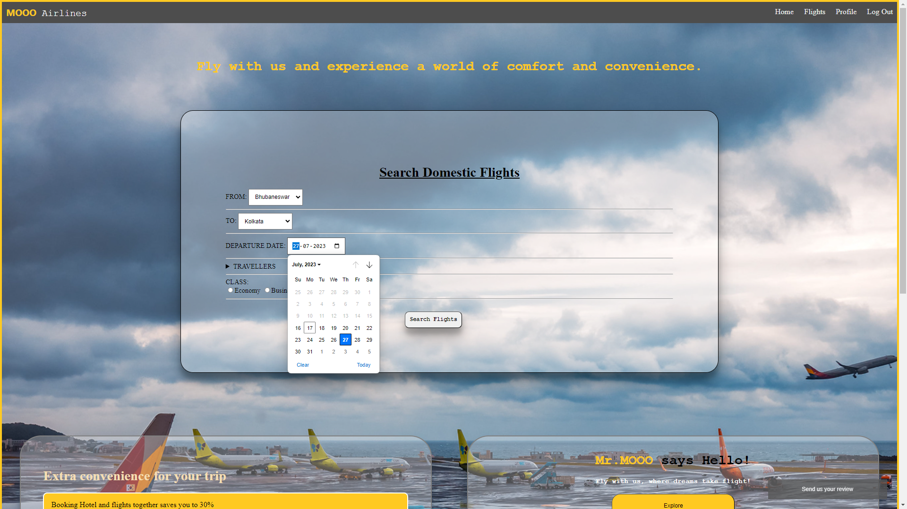
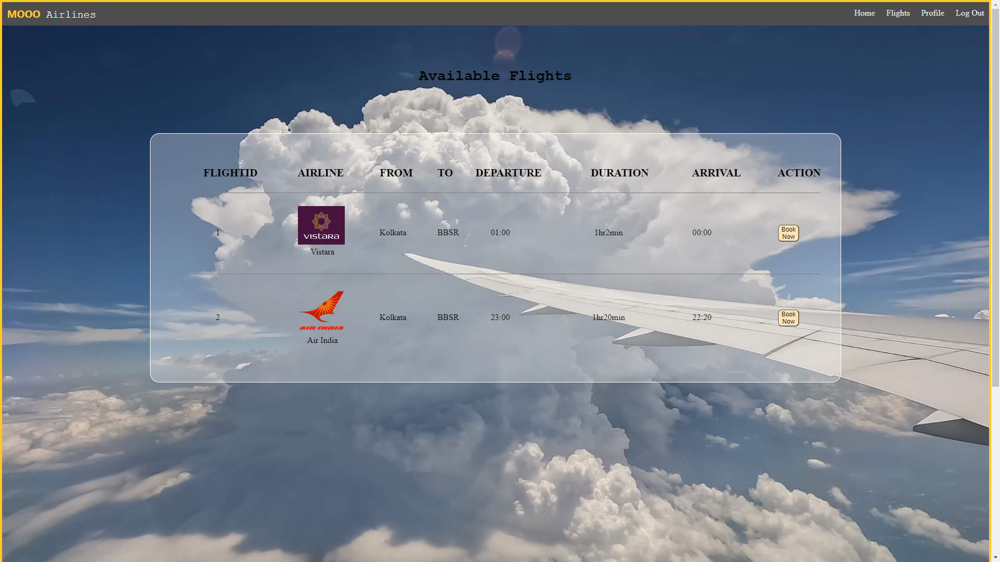
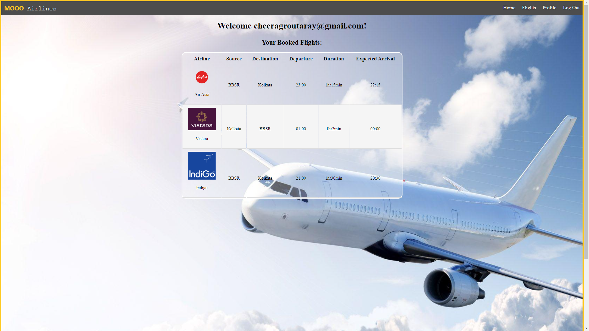
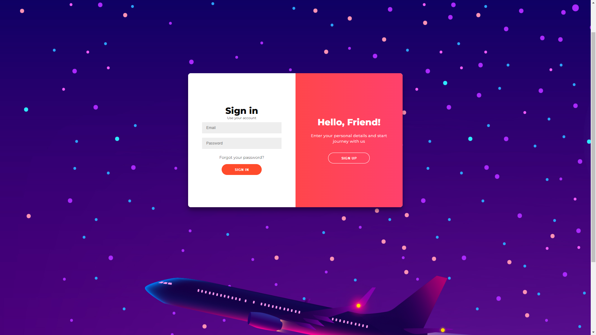
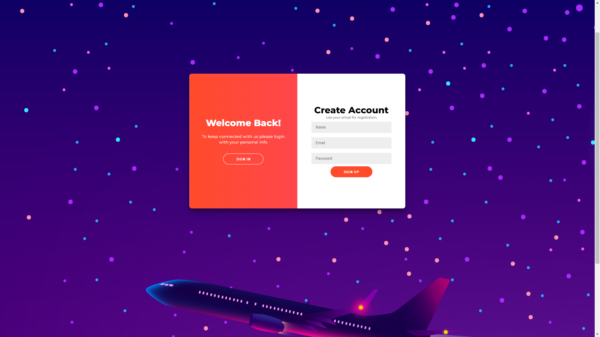

<h1 align="center">
   
  
   
  MOOO Airlines
   
</h1>

<h4 align="center">Fly with us and experience a world of comfort and convenience.</h4>

    
    
    
    

  <a href="#introduction">Introduction</a> •
  <a href="#homepage">Homepage</a> •
  <a href="#flight-list">Flight List</a> •
  <a href="#profile">Sign in/Sign Up</a> •
  <a href="#contributors">Contributors</a>

## Introduction

Welcome to our website! We are dedicated to providing you with a seamless and convenient way to book your flights. With our user-friendly interface, you can easily search for flights and choose from a wide range of domestic destinations. Our website offers comprehensive flight details, flexible booking options. Our knowledgeable customer support team is available around the clock to assist you with any queries or concerns. Trust us to make your travel experience smooth, enjoyable, and hassle-free. Start planning your next adventure with us today and let us take care of your flight bookings!

## Homepage

<h3>Filter Flights at Your Convinience</h3>

- Based on the input parameters, the flights are filtered for the user to create a hassle free experience. - According to Sorce and Destination, the airline are filtered from DataBase. - After "Search Flights" button is clicked, the user is redirected to flight list page.

## Flight List

<h3>Filtered List of Data</h3>

- List of filtered data is presented as per user's requirement. 
- The page also allows user to BOOK the respective flights. 
- After pressing "Book Now" button, the users are redirected to their respective profile pages, where they can view the list of thier booked flights. 
<b><i>- Note: Bookings are confirmed only when the user is successfully logged in.</i></b>

## Profile

<h3>We Keep Record of our User's Data</h3>

- Displays the list of user booked flights. 
- The list contains all the neccessary information about the flight. 
- All the details are minimal for easy comprehension for user and smooth UI/UX.

## Sign in/Sign Up

    
    

- Multipurpose box, which allows Sign in as well as Sign Up in the same page. 
- Uses CSS to create a sliding window animation which is toggled upon respective button clicks to switch between Sign in/Sign Up form. 
- Allows new users to join and authenticates existing user.

## Contributors

>GitHub [@no1Gangster](https://github.com/no1Gangster) &nbsp;&middot;&nbsp;Team Leader 
>GitHub [@smrutiranjan003](https://github.com/smrutiranjan003) &nbsp;&middot;&nbsp;HomePage 
>GitHub [@ADYASHA-2003](https://github.com/ADYASHA-2003) &nbsp;&middot;&nbsp;Flight List 
>GitHub [@Sthita-pragyan](https://github.com/Sthita-pragyan) &nbsp;&middot;&nbsp;Profile Page 
>GitHub [@RojySamal](https://github.com/RojySamal) &nbsp;&middot;&nbsp;Sign in/Sign Up
